# NotificationView

[](https://travis-ci.org/pikachu987/NotificationView)
[](https://cocoapods.org/pods/NotificationView)
[](https://cocoapods.org/pods/NotificationView)
[](https://cocoapods.org/pods/NotificationView)

[](https://developer.apple.com/swift/)

## Introduce

You can easily implement iOS Basic Notification screens.
There is a default theme and a dark theme.
You can attach an image to the Notification screen with only the UIImageView.
You can adjust the disappearance time.
You can get a delegate or callback for the visible and disappearing states.
You can get delegates and callbacks for tap.

|Theme|Multiple|
|---|---|
|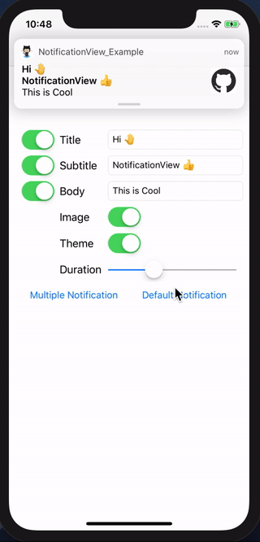|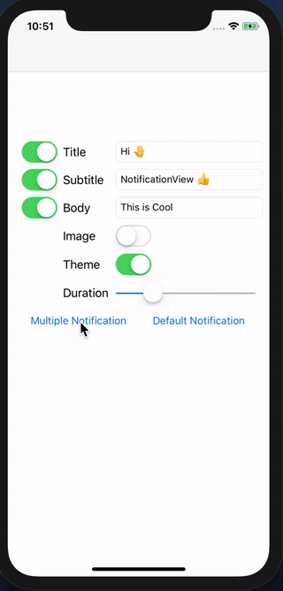|

|Custom|Duration|
|---|---|
|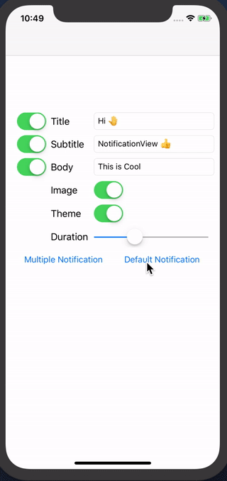|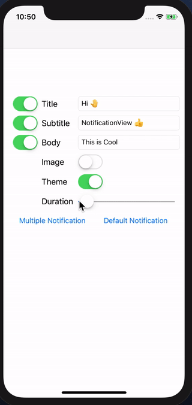|

|Rotate|
|---|
|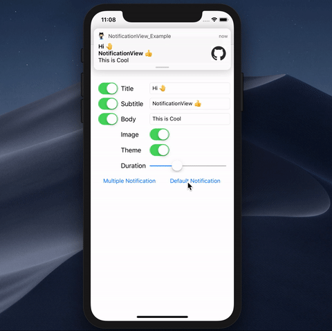|

<br><br>

## Screen

|-|iPhoneSE|iPhone8Plus|
|---|---|---|
|Vertical||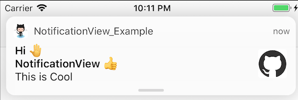|
|Horizontal|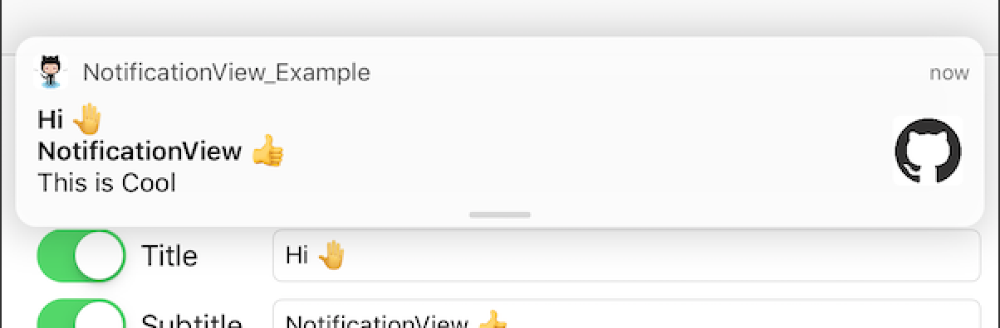|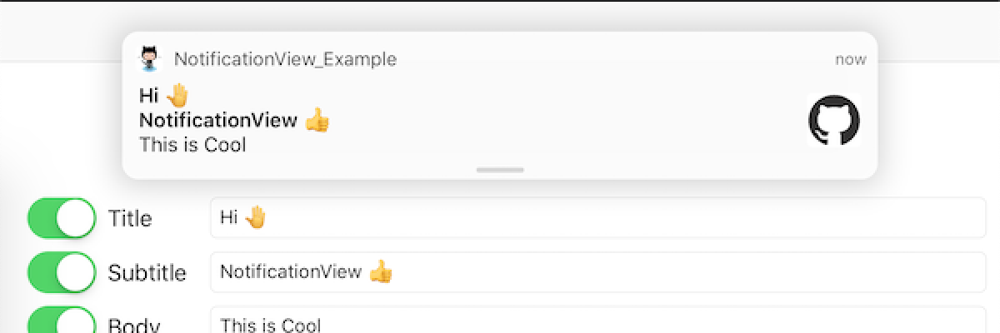|

|-|iPhoneX|iPad|
|---|---|---|
|Vertical|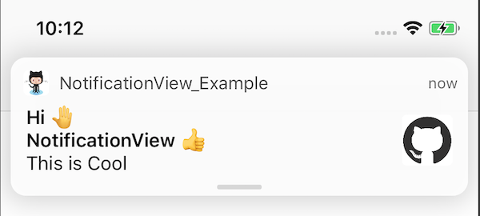|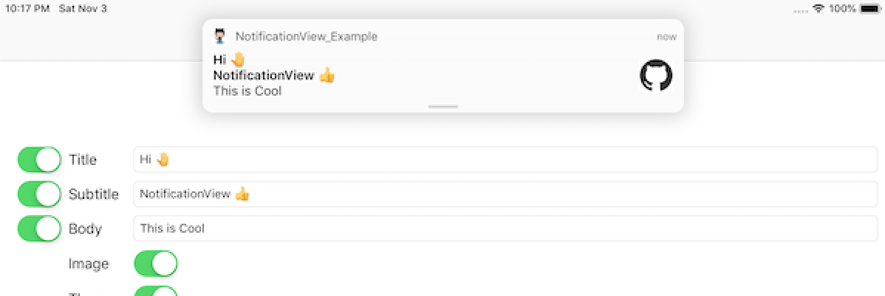|
|Horizontal|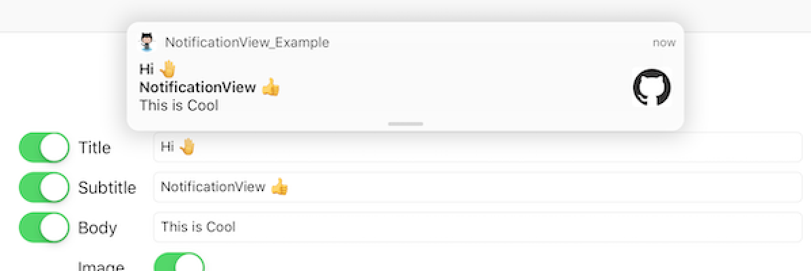|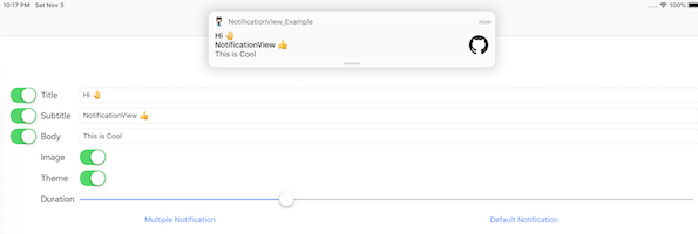|

## Theme

|default|dark|
|---|---|
|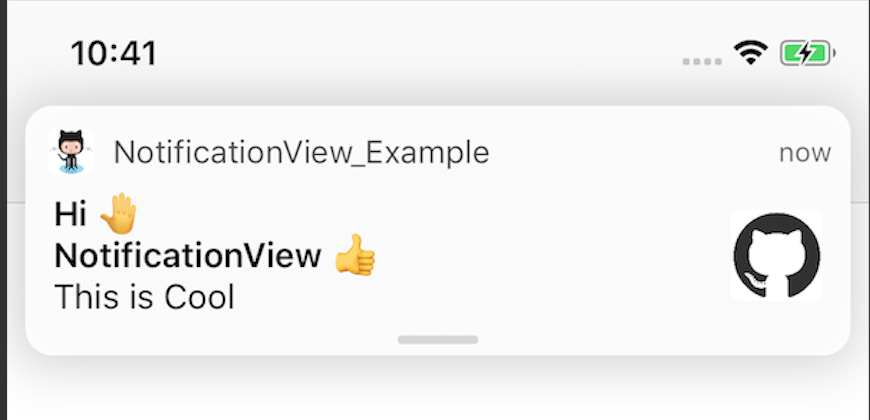|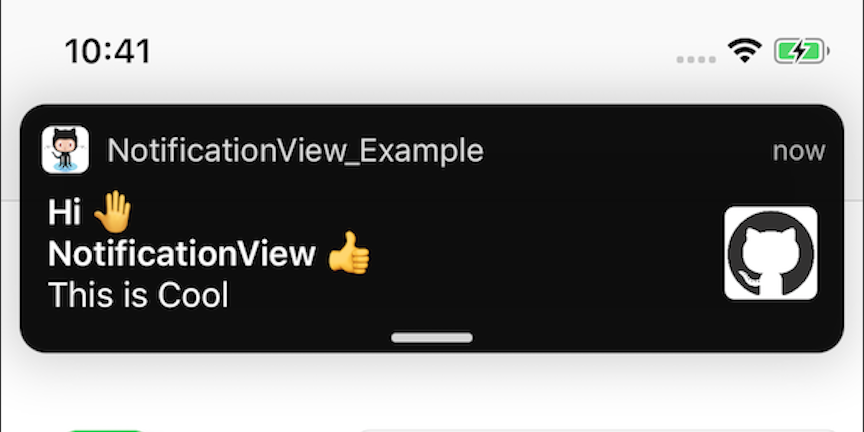|

## Type

|custom1|custom2|
|---|---|
|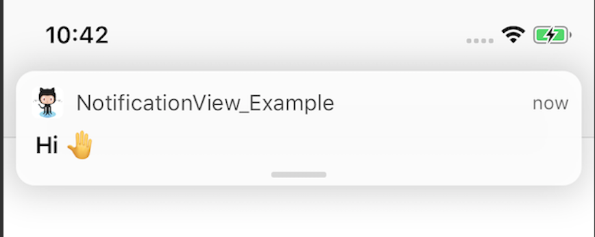|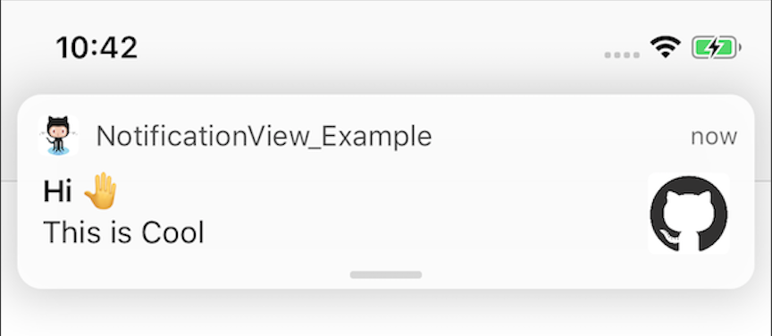|

<br><br>

## Requirements

`NotificationView` written in Swift 5.0. Compatible with iOS 8.0+

## Installation

### Versioning notes

Version 0.2.1 introduces Swift 5.0 support

Version 0.2.0 introduces Swift 4.2 support

Version 0.1.1 introduces Swift 4.0 support

### Cocoapods

NotificationView is available through [CocoaPods](https://cocoapods.org). To install
it, simply add the following line to your Podfile:

```ruby
pod 'NotificationView'
```

### Swift Package Manager

To integrate `NotificationView` via [SPM](https://swift.org/package-manager/) into your Xcode 11 project specify it in Project > Swift Packages:
```
https://github.com/pikachu987/NotificationView
```

## Usage

```swift
import NotificationView
```

### DefaultNotification

```swift
let notificationView = NotificationView.default
notificationView.title = title
notificationView.subtitle = subtitle
notificationView.body = body
notificationView.image = image
notificationView.show()
```

### MultipleNotification

```swift
let notificationView = NotificationView()
notificationView.title = title
notificationView.subtitle = subtitle
notificationView.body = body
notificationView.image = image
notificationView.show()
```

done!

<br><br><br>


### Property

NotificationView

```swift

//Theme for NotificationView. There are dark mode and default mode and custom mode.
notificationView.theme

//The title of the NotificationView.
notificationView.title

//The subtitle of the NotificationView.
notificationView.subtitle

//The body of the NotificationView.
notificationView.body

//The image of the NotificationView.
notificationView.image

//The background color of the NotificationView.
notificationView.backgroundColor

//It is a dictionary that can contain any data.
notificationView.param

//The identifier for the NotificationView.
notificationView.identifier

//The time until the NotificationView is shown and then disappears.
notificationView.hideDuration

//An UIImageView that displays the AppIcon image.
notificationView.iconImageView

//An UILabel that displays the AppName text.
notificationView.appNameLabel

//An UILabel that displays the Date text.
notificationView.dateLabel

//An UILabel that displays the Title text.
notificationView.titleLabel

//An UILabel that displays the Subtitle text.
notificationView.subtitleLabel

//An UILabel that displays the Body text.
notificationView.bodyLabel

//An UIImageView that displays the Image.
notificationView.imageView

```

<br><br>

### Method

NotificationView Show

```swift
notificationView.show()

notificationView.show { (state) in
    print("callback: \(state)")
}

notificationView.showAfter(0.1)

notificationView.showAfter(0.1) { (state) in
    print("callback: \(state)")
}
```

NotificationView Hide

```swift
notificationView.hide()

notificationView.hideAfter(0.1)
```


<br><br>

### Delegate

```swift
class ViewController: UIViewController {

    override func viewDidLoad() {
        super.viewDidLoad()

        let notificationView = NotificationView()
        notificationView.delegate = self
    }
}

extension ViewController: NotificationViewDelegate {

    /**
    Called when NotificationView is willAppear.
    - Parameters:
    - notificationView: NotificationView
    */
    func notificationViewWillAppear(_ notificationView: NotificationView) {
        print("delegate: notificationViewWillAppear")
    }

    /**
    Called when NotificationView is didAppear.
    - Parameters:
    - notificationView: NotificationView
    */
    func notificationViewDidAppear(_ notificationView: NotificationView) {
        print("delegate: notificationViewDidAppear")
    }

    /**
    Called when NotificationView is willDisappear.
    - Parameters:
    - notificationView: NotificationView
    */
    func notificationViewWillDisappear(_ notificationView: NotificationView) {
        print("delegate: notificationViewWillDisappear")
    }

    /**
    Called when NotificationView is didDisappear.
    - Parameters:
    - notificationView: NotificationView
    */
    func notificationViewDidDisappear(_ notificationView: NotificationView) {   
        print("delegate: notificationViewDidDisappear")
    }

    /**
    Called when the NotificationView is touched.
    - Parameters:
    - notificationView: NotificationView
    */
    func notificationViewDidTap(_ notificationView: NotificationView) {
        print("delegate: notificationViewDidTap")
    }
}

```

### Custom

```swift
let notificationView = NotificationView()
notificationView.title = title
notificationView.subtitle = subtitle
notificationView.body = body
notificationView.image = image

notificationView.theme = .custom
notificationView.backgroundColor = .red
notificationView.appNameLabel.textColor = .blue
notificationView.dateLabel.textColor = .blue
notificationView.titleLabel.textColor = .blue
notificationView.subtitleLabel.textColor = .blue
notificationView.bodyLabel.textColor = .blue

notificationView.show()
```

<br><br>

## Author

pikachu987, pikachu77769@gmail.com

## License

NotificationView is available under the MIT license. See the LICENSE file for more info.
